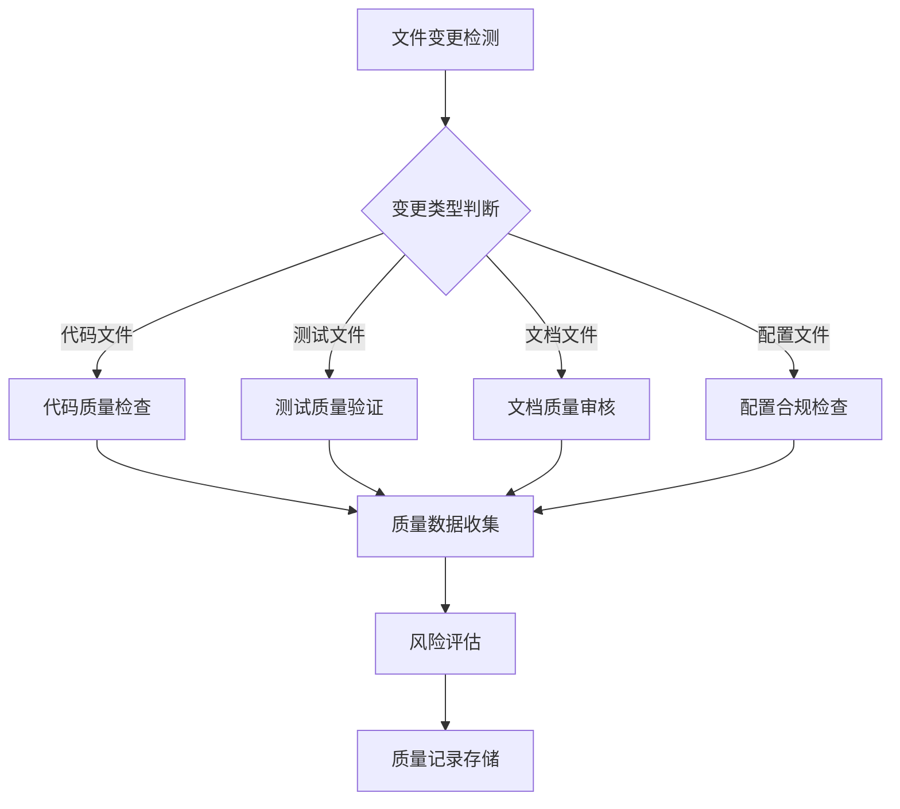
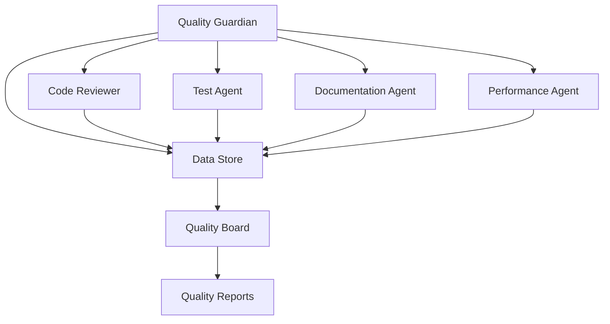

# Quality Guardian Agent 设计规范

## 触发机制

### 自动触发条件
```yaml
文件操作触发:
  - 代码文件修改: "*.py", "*.js", "*.ts", "*.go", "*.java"
  - 配置文件变更: "*.yaml", "*.json", "*.ini", "*.toml"
  - 测试文件修改: "test_*.py", "*_test.py", "*.test.js"
  - 文档文件更新: "*.md", "*.rst", "*.txt"
  - 构建脚本变更: "Makefile", "*.sh", "*.bat", "Dockerfile"

Git操作触发:
  - Pre-commit: 提交前质量检查
  - Post-commit: 提交后质量记录
  - Push事件: 推送时质量验证
  - Merge事件: 合并时质量审计

质量指标触发:
  - 代码覆盖率下降: >5%下降触发警告
  - 测试通过率下降: <95%触发审查
  - 构建失败: 立即触发问题分析
  - 性能回归: >10%性能下降触发调查
```

### 手动调用模式
```bash
# 全面质量审计
@quality-guardian audit --scope=project --depth=comprehensive

# 特定模块质量检查
@quality-guardian check --module=core --type=code-quality

# 合规性检查
@quality-guardian compliance --standard=enterprise --output=report

# 质量趋势分析
@quality-guardian trend --period=30days --metrics=coverage,performance
```

## Agent工作流程设计

### 阶段1: 质量监控 (Monitoring)


### 阶段2: 质量分析 (Analysis)
```python
class QualityAnalysisEngine:
    """质量分析引擎"""
    
    def analyze_change_impact(self, file_changes):
        """分析变更影响"""
        impact_analysis = {
            'code_impact': self._analyze_code_impact(file_changes),
            'test_impact': self._analyze_test_impact(file_changes),
            'documentation_impact': self._analyze_doc_impact(file_changes),
            'configuration_impact': self._analyze_config_impact(file_changes)
        }
        return impact_analysis
    
    def calculate_quality_score(self, metrics):
        """计算质量得分"""
        weights = {
            'code_coverage': 0.3,
            'test_quality': 0.25,
            'code_maintainability': 0.2,
            'documentation_completeness': 0.15,
            'compliance_score': 0.1
        }
        return sum(metrics[k] * weights[k] for k in weights)
```

### 阶段3: 质量决策 (Decision)
```yaml
决策矩阵:
  高风险变更:
    条件: "覆盖率下降>10% OR 核心模块修改 OR 测试失败>5%"
    动作: "阻止提交 + 发送警告 + 要求审查"
    
  中等风险变更:
    条件: "覆盖率下降5-10% OR 非核心模块修改 OR 测试失败1-5%"  
    动作: "警告提示 + 记录风险 + 建议审查"
    
  低风险变更:
    条件: "覆盖率稳定 OR 文档更新 OR 测试通过100%"
    动作: "自动通过 + 记录变更 + 更新指标"
```

## 质量标准和检查清单

### 代码质量标准
```python
CODE_QUALITY_STANDARDS = {
    'coverage_requirements': {
        'unit_tests': {'minimum': 70, 'target': 80, 'excellent': 90},
        'integration_tests': {'minimum': 60, 'target': 70, 'excellent': 80},
        'e2e_tests': {'minimum': 50, 'target': 60, 'excellent': 70}
    },
    'complexity_limits': {
        'cyclomatic_complexity': {'max': 10, 'warning': 8},
        'function_length': {'max': 50, 'warning': 30},
        'class_length': {'max': 500, 'warning': 300}
    },
    'maintainability_metrics': {
        'duplication_ratio': {'max': 0.05, 'warning': 0.03},
        'dependency_depth': {'max': 5, 'warning': 3},
        'api_stability': {'min': 0.9, 'target': 0.95}
    }
}
```

### 测试质量检查清单
```yaml
测试质量检查项:
  结构质量:
    - [ ] 测试文件命名规范 (test_*.py)
    - [ ] 测试类组织合理 (每类<20个方法)
    - [ ] 测试方法长度适中 (<30行)
    - [ ] Mock使用合理 (外部依赖Mock，内部逻辑保留)
  
  功能质量:
    - [ ] 测试覆盖核心业务逻辑
    - [ ] 错误路径得到测试
    - [ ] 边界条件得到验证
    - [ ] 回归测试保护关键功能
  
  性能质量:
    - [ ] 单个测试执行<1秒
    - [ ] 测试套件总时间<5分钟
    - [ ] 并行执行无竞态条件
    - [ ] 资源使用合理(内存、CPU)
```

### 文档质量标准
```yaml
文档质量要求:
  完整性检查:
    - [ ] API接口有完整文档
    - [ ] 配置参数有说明文档  
    - [ ] 部署流程有详细指南
    - [ ] 故障排除有解决方案
  
  准确性验证:
    - [ ] 代码示例可运行
    - [ ] 版本信息与实际一致
    - [ ] 链接和引用有效
    - [ ] 截图和图表最新
  
  可读性评估:
    - [ ] 结构层次清晰
    - [ ] 语言表达准确
    - [ ] 格式规范统一
    - [ ] 目标读者明确
```

## 数据存储架构

### 独立质量数据存储
```
quality_records/
├── audit_logs/                 # 审计日志(不可变)
│   ├── 2025/01/
│   │   ├── code_changes.jsonl     # 代码变更记录
│   │   ├── test_results.jsonl     # 测试结果记录
│   │   └── quality_metrics.jsonl # 质量指标记录
├── compliance_reports/         # 合规报告
│   ├── monthly/
│   └── quarterly/
├── quality_metrics/           # 质量指标历史
│   ├── coverage_history.json
│   ├── performance_trends.json
│   └── defect_tracking.json
├── risk_assessments/          # 风险评估结果
│   ├── change_impact_analysis.json
│   └── quality_risk_matrix.json
└── quality_standards/         # 质量标准配置
    ├── code_standards.yaml
    ├── test_standards.yaml
    └── documentation_standards.yaml
```

### 数据隔离原则
```python
class QualityDataManager:
    """质量数据管理器 - 确保数据隔离"""
    
    def __init__(self):
        # 质量数据存储路径独立于源代码
        self.quality_root = Path(".quality")
        self.audit_path = self.quality_root / "audit_logs"
        self.metrics_path = self.quality_root / "metrics"
        self.reports_path = self.quality_root / "reports"
        
    def record_change(self, change_type, details, metadata):
        """记录变更 - 不影响源代码"""
        record = {
            'timestamp': datetime.utcnow().isoformat(),
            'change_type': change_type,
            'details': details,
            'metadata': metadata,
            'quality_impact': self._assess_quality_impact(details)
        }
        
        # 写入独立的审计日志文件
        audit_file = self.audit_path / f"{datetime.now().strftime('%Y%m')}" / "changes.jsonl"
        self._append_audit_record(audit_file, record)
    
    def _assess_quality_impact(self, details):
        """评估质量影响 - 独立分析"""
        return {
            'risk_level': self._calculate_risk_level(details),
            'affected_components': self._identify_affected_components(details),
            'recommended_actions': self._generate_recommendations(details)
        }
```

## 与其他Agent的集成方案

### Agent协作架构


### 协作协议定义
```python
class AgentCollaborationProtocol:
    """Agent协作协议"""
    
    def __init__(self):
        self.collaboration_rules = {
            'code_review_agent': {
                'trigger_condition': 'code_file_modified',
                'data_exchange': ['code_quality_metrics', 'complexity_analysis'],
                'decision_authority': 'quality_guardian_has_veto_power'
            },
            'test_agent': {
                'trigger_condition': 'test_execution_completed', 
                'data_exchange': ['coverage_data', 'test_results'],
                'decision_authority': 'shared_responsibility'
            },
            'documentation_agent': {
                'trigger_condition': 'api_changes_detected',
                'data_exchange': ['api_documentation_status', 'completeness_metrics'],
                'decision_authority': 'quality_guardian_advisory'
            }
        }
    
    def coordinate_quality_check(self, change_event):
        """协调质量检查"""
        # 1. 通知相关Agent
        relevant_agents = self._identify_relevant_agents(change_event)
        
        # 2. 并行执行检查
        check_results = {}
        for agent in relevant_agents:
            check_results[agent] = self._request_quality_check(agent, change_event)
        
        # 3. 综合分析结果
        overall_quality_score = self._synthesize_results(check_results)
        
        # 4. 做出最终决策
        return self._make_quality_decision(overall_quality_score)
```

### 质量决策权限矩阵
```yaml
决策权限分配:
  Quality Guardian (最终决策权):
    - 阻止高风险变更提交
    - 要求强制质量审查
    - 设定质量标准和阈值
    - 生成合规报告
  
  Code Review Agent (建议权):
    - 代码质量问题识别
    - 重构建议提供
    - 最佳实践推荐
  
  Test Agent (执行权):
    - 测试用例执行
    - 覆盖率数据收集
    - 测试质量评估
  
  Documentation Agent (维护权):
    - 文档同步更新
    - 完整性检查
    - 格式规范化
```

## 实施路线图

### Phase 1: 基础设施建设 (Week 1-2)
```yaml
任务列表:
  - [ ] 建立独立的质量数据存储结构
  - [ ] 实现基础的文件监控机制
  - [ ] 开发质量指标收集器
  - [ ] 创建质量标准配置系统
  - [ ] 设置基本的审计日志记录
```

### Phase 2: 核心功能开发 (Week 3-4)  
```yaml
任务列表:
  - [ ] 实现质量分析引擎
  - [ ] 开发风险评估算法
  - [ ] 建立质量决策矩阵
  - [ ] 创建Agent间协作协议
  - [ ] 实现质量报告生成器
```

### Phase 3: 集成测试验证 (Week 5-6)
```yaml
任务列表:
  - [ ] 与VideoLingo项目集成测试
  - [ ] 验证数据隔离效果
  - [ ] 测试Agent协作机制
  - [ ] 优化性能和响应时间
  - [ ] 完善错误处理和恢复
```

### Phase 4: 生产部署优化 (Week 7-8)
```yaml
任务列表:
  - [ ] 建立监控和告警系统
  - [ ] 优化存储和查询性能
  - [ ] 完善用户界面和体验
  - [ ] 编写操作和维护文档
  - [ ] 培训和知识转移
```

## 质量保证效果评估

### 成功指标定义
```yaml
技术指标:
  数据分离度: "质量数据与源码0混合度"
  审计完整性: "100%变更可追溯"  
  响应及时性: "<5秒质量检查响应"
  决策准确性: ">95%风险识别准确率"

业务指标:  
  质量提升度: "整体质量分数提升20%"
  缺陷减少率: "生产缺陷减少50%"
  开发效率: "质量相关返工减少40%"
  合规达成率: "100%通过审计要求"
```

### 持续改进机制
```python
class ContinuousImprovement:
    """持续改进机制"""
    
    def monthly_quality_review(self):
        """月度质量回顾"""
        metrics = self.collect_monthly_metrics()
        trends = self.analyze_quality_trends(metrics)
        issues = self.identify_quality_issues(trends)
        
        improvement_plan = self.generate_improvement_plan(issues)
        self.execute_improvements(improvement_plan)
        
        return {
            'review_date': datetime.now().isoformat(),
            'key_findings': issues,
            'improvement_actions': improvement_plan,
            'expected_impact': self.estimate_improvement_impact(improvement_plan)
        }
    
    def adaptive_standards_adjustment(self):
        """自适应标准调整"""
        current_performance = self.get_current_quality_performance()
        industry_benchmarks = self.get_industry_benchmarks()
        
        if current_performance['overall_score'] > industry_benchmarks['median'] * 1.1:
            # 表现优秀，可以提高标准
            self.raise_quality_standards(increment=0.05)
        elif current_performance['overall_score'] < industry_benchmarks['median'] * 0.9:
            # 表现不佳，制定改进计划
            self.create_quality_improvement_plan()
```

这个质量管理专家agent设计确保了：

1. **严格的数据分离**：质量数据完全独立存储，不污染源代码
2. **完整的过程记录**：所有质量相关活动都有审计追踪
3. **智能的协作机制**：与其他agent有效协调，避免冲突
4. **实用的质量标准**：基于实际项目需求制定可执行的标准
5. **持续的改进能力**：通过数据分析不断优化质量管理效果

该方案务实可行，避免了过度复杂化，重点关注质量管理的核心价值：提升代码质量、降低风险、满足合规要求。