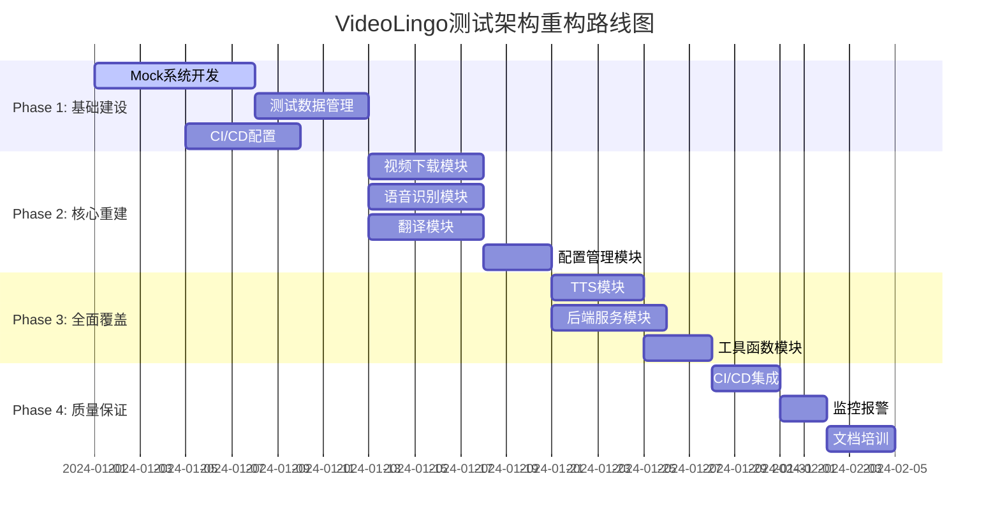

# VideoLingo 测试架构重构文档目录

## 📋 文档概览

本目录包含VideoLingo项目测试架构重构的完整指导文档，为项目开发负责人和团队成员提供从问题诊断到解决方案实施的全方位指导。

## 📚 文档结构

### 🎯 核心文档

#### 1. [总体指导文档](./TEST_REFACTORING_MASTER_GUIDE.md)
**目标受众**: 项目开发负责人、架构师
**文档作用**: 测试重构的总体战略规划和执行路线图

**主要内容**:
- 📊 问题诊断总结 (97个测试文件→13%覆盖率)
- 🎯 重构战略目标 (目标65%覆盖率，-75%执行时间)
- 🏗️ 新测试架构设计 (AI/ML项目特定架构)
- 📋 四阶段实施路线图 (8周完整计划)
- 📊 质量保证体系设计
- 💡 风险管理和缓解策略

#### 2. [技术实施详细指南](./TECHNICAL_IMPLEMENTATION_GUIDE.md)
**目标受众**: 开发工程师、测试工程师
**文档作用**: 具体的技术实施细节和代码示例

**主要内容**:
- 🏗️ Mock管理系统完整实现
- 📁 测试数据管理系统设计
- ⚙️ pytest高性能配置优化
- 🔧 conftest.py简化配置方案
- 🚨 常见问题故障排除指南
- ⚡ 性能优化技巧和最佳实践

#### 3. [质量标准和检查清单](./QUALITY_STANDARDS_CHECKLIST.md)
**目标受众**: QA工程师、项目负责人
**文档作用**: 质量标准定义和完整的验收检查清单

**主要内容**:
- 🎯 分层质量标准定义 (核心模块80%+覆盖率)
- ✅ 四阶段质量检查清单 (160+检查项)
- 📊 自动化质量评估工具
- 📈 持续质量监控机制
- 🚀 质量改进建议和时间规划

#### 4. [团队协作指南](./TEAM_COLLABORATION_GUIDE.md)
**目标受众**: 全体开发团队
**文档作用**: 重构期间的团队协作流程和最佳实践

**主要内容**:
- 👥 团队角色职责分工
- 🔄 协作工作流程设计
- 📅 时间规划和会议机制
- 💬 沟通工具和信息共享
- 🚀 协作最佳实践和效率工具

## 🚀 使用指南

### 阶段1: 理解现状和目标 
1. **首先阅读**: [总体指导文档](./TEST_REFACTORING_MASTER_GUIDE.md)
2. **重点关注**: 问题诊断总结、重构目标、实施路线图
3. **团队讨论**: 确认重构必要性和可行性

### 阶段2: 制定具体实施计划
1. **详细学习**: [技术实施详细指南](./TECHNICAL_IMPLEMENTATION_GUIDE.md)  
2. **技术准备**: Mock系统、测试数据管理、工具配置
3. **人员分工**: 参考团队协作指南分配角色

### 阶段3: 开始重构实施
1. **遵循标准**: [质量标准和检查清单](./QUALITY_STANDARDS_CHECKLIST.md)
2. **协作流程**: [团队协作指南](./TEAM_COLLABORATION_GUIDE.md)
3. **定期检查**: 使用自动化质量评估工具

### 阶段4: 持续改进优化
1. **质量监控**: 建立持续质量监控机制
2. **团队培训**: 定期技术分享和最佳实践更新
3. **文档维护**: 根据实践经验更新文档

## 📊 关键指标和目标

### 当前状况 (重构前)
```
📈 测试现状统计
├── 测试文件数量: 97个
├── 测试代码行数: 52,916行  
├── 整体覆盖率: 13.2%
├── 分支覆盖率: 4.5%
├── 执行时间: 15-25分钟
└── 投入产出比: 极度失衡
```

### 目标状况 (重构后)
```
🎯 重构目标指标
├── 测试文件数量: 30个 (-69%)
├── 整体覆盖率: 65% (+400%)
├── 核心模块覆盖率: 80% (+300-400%)
├── 执行时间: 3-5分钟 (-75%)
└── 维护成本: 降低70%
```

## 🔄 实施路线图总览



## ⚡ 快速开始

### 立即行动清单
- [ ] **本周**: 阅读并理解总体指导文档
- [ ] **本周**: 组织团队架构讨论会议
- [ ] **下周**: 确定实施团队和责任分工
- [ ] **下周**: 开始Phase 1基础设施建设

### 紧急联系和支持
- **架构设计问题**: 联系系统架构师
- **实施技术问题**: 联系测试工程师  
- **协作流程问题**: 联系项目管理员
- **质量标准问题**: 联系QA负责人

## 🎯 成功标准

### 短期目标 (Month 1-2)
- ✅ 整体覆盖率从13%提升至65%
- ✅ 测试执行时间从15-25分钟缩短至3-5分钟
- ✅ 测试稳定性达到95%以上
- ✅ 团队掌握新测试架构

### 中期目标 (Month 3-6) 
- ✅ 建立完整质量保证体系
- ✅ 实现CI/CD自动化测试流水线
- ✅ 缺陷发现率提升80%
- ✅ 开发效率显著改善

### 长期目标 (Month 6-12)
- ✅ 测试架构支持项目长期发展
- ✅ 基于高质量测试支持快速迭代
- ✅ 建立行业领先的测试最佳实践
- ✅ 为产品商业化提供质量保障

## 📞 文档维护

### 版本管理
- **当前版本**: v1.0
- **最后更新**: 2024年8月
- **维护团队**: VideoLingo架构团队
- **更新频率**: 季度更新，问题驱动更新

### 反馈和改进
- **文档反馈**: 通过GitHub Issues提交文档改进建议
- **实践分享**: 定期收集团队实践经验和最佳实践
- **持续优化**: 根据项目发展和技术演进更新文档

---

## 🎉 总结

VideoLingo项目测试架构重构是一个**系统性工程**，需要从技术、流程、团队协作等多个维度进行全面改进。通过遵循本文档目录中的指导，项目团队能够：

1. **系统性解决**当前测试效率低下的根本问题
2. **建立现代化**的AI/ML项目测试架构
3. **显著提升**代码质量和开发效率
4. **为项目长期发展**奠定坚实的质量基础

**开始行动吧！** 从阅读总体指导文档开始，让我们一起将VideoLingo的测试架构提升到行业领先水平。

---

*📋 VideoLingo测试架构重构文档 - 为项目质量保驾护航*