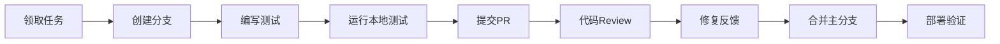
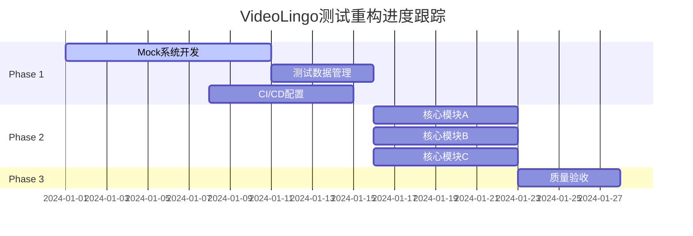
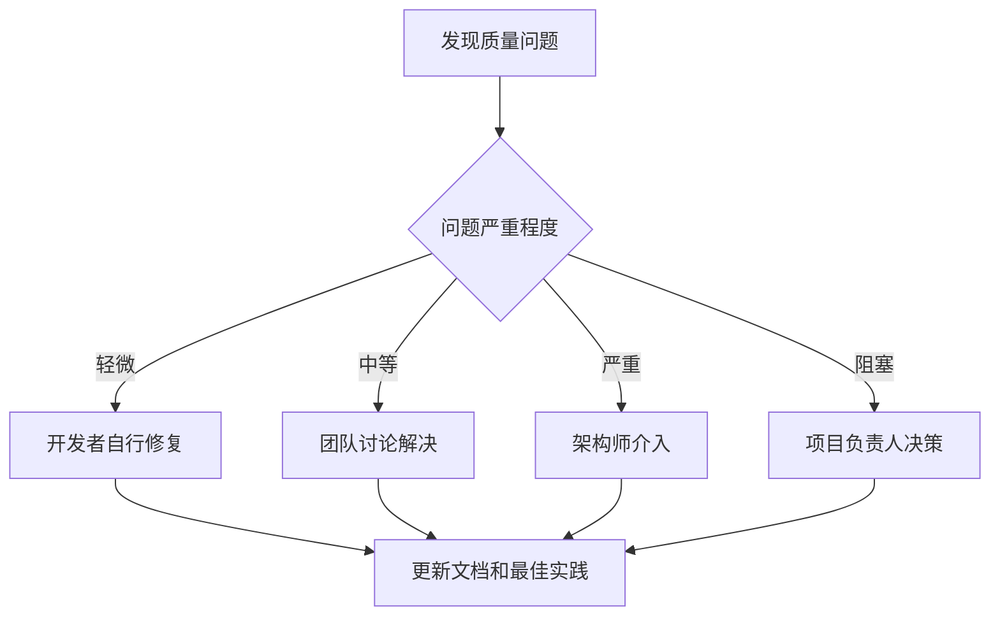

# VideoLingo 测试架构团队协作指南

## 📋 概述

本文档为VideoLingo项目开发团队提供测试架构重构期间和后续维护中的协作指南，包括工作流程、角色职责、沟通机制和最佳实践。

## 👥 团队角色和职责

### 1. 项目开发负责人 (Project Lead)
**主要职责**:
- 总体测试架构重构决策和优先级制定
- 资源分配和时间规划
- 跨团队协调和沟通
- 质量目标设定和验收

**具体任务**:
- [ ] 批准测试架构重构方案
- [ ] 分配开发人员到不同Phase的任务
- [ ] 定期Review重构进度和质量
- [ ] 协调解决技术争议和阻塞问题

### 2. 测试架构师 (Test Architect)  
**主要职责**:
- 测试架构设计和技术方案制定
- Mock系统和测试基础设施实现
- 测试工具链选型和配置
- 技术难点攻关和最佳实践推广

**具体任务**:
- [ ] 设计和实现Mock管理系统
- [ ] 配置pytest和覆盖率工具
- [ ] 制定测试编写规范和模板
- [ ] 提供技术培训和指导

### 3. 核心开发工程师 (Core Developers)
**主要职责**:
- 按照新架构重写核心模块测试
- 确保测试覆盖率达到要求标准
- 参与代码Review和质量保证
- 维护和优化现有测试代码

**具体任务**:
- [ ] 重构分配的核心模块测试 (每人2-3个模块)
- [ ] 编写高质量的单元测试和集成测试
- [ ] 参与每日Stand-up和进度同步
- [ ] 协作解决技术问题和依赖关系

### 4. 质量保证工程师 (QA Engineer)
**主要职责**:
- 测试质量监控和评估
- 自动化测试流程建设
- 测试报告生成和分析
- 质量标准执行和改进建议

**具体任务**:
- [ ] 运行质量检查脚本和覆盖率分析
- [ ] 建立CI/CD测试流水线
- [ ] 生成每日/周测试质量报告
- [ ] 识别质量风险和改进机会

## 🔄 协作工作流程

### 1. 日常开发工作流

#### 1.1 开发流程 (Developer Workflow)


**详细步骤**:
1. **任务领取**: 从GitHub Issues或Project Board领取任务
2. **分支创建**: `git checkout -b feature/test-module-xyz`
3. **测试编写**: 按照测试架构和质量标准编写
4. **本地验证**: 运行完整测试套件确保通过
5. **提交PR**: 创建Pull Request并填写模板
6. **代码Review**: 至少一位同事Review通过
7. **修复反馈**: 根据Review意见修复问题
8. **合并部署**: 合并到主分支并验证CI/CD

#### 1.2 PR模板和检查清单
```markdown
# Pull Request Template

## 📋 变更描述
- [ ] 重构了哪个模块的测试
- [ ] 增加了哪些新的测试用例
- [ ] 修复了哪些测试问题
- [ ] 提升了多少覆盖率

## ✅ 自检清单
- [ ] 所有测试本地运行通过
- [ ] 覆盖率达到模块要求标准
- [ ] 测试命名符合规范
- [ ] Mock使用合理且最小化
- [ ] 代码符合团队风格指南
- [ ] 有必要的注释和文档

## 📊 覆盖率变化
- 重构前覆盖率: X%
- 重构后覆盖率: Y%
- 提升幅度: +Z%

## 🧪 测试类型
- [ ] 单元测试
- [ ] 组件测试  
- [ ] 集成测试
- [ ] 端到端测试

## 📝 注意事项
- 有无breaking changes
- 依赖的其他PR或Issue
- 需要特殊测试环境的说明
```

### 2. 代码Review工作流

#### 2.1 Review标准和检查点
**必须检查项目**:
- [ ] **功能正确性**: 测试是否正确验证了业务逻辑
- [ ] **覆盖率提升**: 是否达到模块覆盖率要求
- [ ] **测试独立性**: 测试之间是否相互独立
- [ ] **Mock合理性**: Mock使用是否合理且最小化
- [ ] **命名规范**: 测试命名是否符合团队标准
- [ ] **性能影响**: 是否有性能回归
- [ ] **维护性**: 代码是否易于理解和维护

**Review评分标准**:
- **👍 Approve**: 符合所有标准，可直接合并
- **💬 Comment**: 有改进建议但不阻塞合并
- **🔄 Request Changes**: 有问题必须修复后才能合并

#### 2.2 Review流程最佳实践
```python
# Review Comment模板

# 👍 良好实践示例
"""
Great work on improving coverage from 15% to 85%! The test cases are well-structured 
and cover both happy path and edge cases effectively.
"""

# 💬 建设性建议示例  
"""
Consider extracting the common setup logic into a fixture to reduce duplication:

```python
@pytest.fixture
def sample_video_data():
    return {
        'url': 'https://example.com/video',
        'title': 'Test Video',
        'duration': 120
    }
```

This would make the tests more maintainable.
"""

# 🔄 必须修复示例
"""
❌ This test is calling the real API instead of using mock:

```python
def test_download_video():
    result = ytdlp.download("https://real-url.com")  # Real API call!
```

Please use the APIServiceMock fixture to avoid external dependencies.
"""
```

### 3. 持续集成工作流

#### 3.1 CI/CD流水线设计
```yaml
# .github/workflows/test-quality.yml
name: Test Quality Pipeline

on:
  push:
    branches: [ main, develop ]
  pull_request:
    branches: [ main ]

jobs:
  test-quality:
    runs-on: ubuntu-latest
    
    steps:
    - name: Checkout code
      uses: actions/checkout@v3
      
    - name: Setup Python
      uses: actions/setup-python@v4
      with:
        python-version: '3.9'
        
    - name: Install dependencies
      run: |
        pip install -r requirements.txt
        pip install -r requirements-test.txt
        
    - name: Run quality checks
      run: |
        python -m tests.utils.quality_checker
        
    - name: Run fast tests
      run: |
        pytest tests/unit tests/component -v --cov=core --cov-fail-under=65
        
    - name: Run integration tests
      run: |
        pytest tests/integration -v --maxfail=5
        
    - name: Generate coverage report
      run: |
        coverage html
        coverage xml
        
    - name: Upload coverage to Codecov
      uses: codecov/codecov-action@v3
      
    - name: Quality gate check
      run: |
        python -m tests.utils.quality_gate_check
```

#### 3.2 质量门控设置
```python
# tests/utils/quality_gate_check.py
def main():
    """质量门控检查"""
    
    # 检查覆盖率
    coverage_report = load_coverage_report()
    if coverage_report['overall'] < 65:
        print(f"❌ Coverage {coverage_report['overall']}% below 65%")
        sys.exit(1)
        
    # 检查核心模块覆盖率
    for module in CORE_MODULES:
        if coverage_report.get(module, 0) < 80:
            print(f"❌ Core module {module} coverage below 80%")
            sys.exit(1)
            
    # 检查测试执行时间
    if get_test_execution_time() > 300:  # 5分钟
        print("❌ Test execution time exceeds 5 minutes")
        sys.exit(1)
        
    print("✅ All quality gates passed!")
```

## 📅 协作时间规划

### 1. 重构阶段时间安排

#### Phase 1: 基础设施建设 (Week 1-2)
**团队分工**:
- **测试架构师**: Mock系统设计和实现 (100%时间)
- **1名核心开发**: 测试数据管理系统 (50%时间)  
- **QA工程师**: CI/CD流水线建设 (75%时间)
- **其他开发**: 继续正常业务开发 (正常节奏)

**每日协作**:
- **Daily Standup** (10:00 AM, 15分钟)
  - 昨日完成的任务和遇到的问题
  - 今日计划和需要的支持
  - 风险和阻塞问题识别

#### Phase 2: 核心模块重建 (Week 3-4)  
**团队分工**:
- **开发A**: _1_ytdlp.py + _2_asr.py 模块测试
- **开发B**: translate_lines.py + ask_gpt.py 模块测试
- **开发C**: video_manager.py + config_utils.py 模块测试
- **QA工程师**: 质量监控和报告生成 (100%时间)

**协作机制**:
- **双人结对** (Pair Programming): 复杂模块采用结对编程
- **交叉Review**: 每个模块至少2人Review
- **技术分享**: 每周2次技术分享会 (30分钟)

### 2. 定期协作会议

#### 2.1 Daily Standup (每日晨会)
**时间**: 每工作日 10:00-10:15
**参与者**: 全体开发团队
**议程**:
- 昨日完成情况 (每人2分钟)
- 今日计划 (每人1分钟) 
- 阻塞问题和需求 (每人1分钟)
- 快速决策和协调 (3分钟)

#### 2.2 Weekly Review (周回顾)
**时间**: 每周五 15:00-16:00
**参与者**: 全体团队 + 项目负责人
**议程**:
- 本周完成情况总结 (10分钟)
- 覆盖率和质量指标Review (15分钟)
- 下周计划和优先级 (15分钟)
- 技术问题讨论和决策 (15分钟)
- 流程改进建议 (5分钟)

#### 2.3 Architecture Review (架构评审)
**时间**: 每两周一次，周三 14:00-15:30
**参与者**: 架构师 + 资深开发 + 项目负责人
**议程**:
- 架构设计方案Review (30分钟)
- 技术难点和解决方案讨论 (30分钟)
- 工具链和最佳实践更新 (20分钟)
- 长期技术规划 (10分钟)

## 💬 沟通机制和工具

### 1. 沟通渠道设置

#### 1.1 实时沟通
- **Slack/Teams频道**:
  - `#videolingo-test-refactor`: 重构专用频道
  - `#videolingo-dev`: 日常开发讨论
  - `#videolingo-qa`: 质量和测试讨论
- **视频会议**: Zoom/Teams用于复杂技术讨论

#### 1.2 异步沟通
- **GitHub Issues**: 任务分配和进度跟踪
- **GitHub Projects**: 可视化项目管理
- **GitHub Discussions**: 技术方案讨论
- **文档协作**: 共享文档用于方案设计

### 2. 信息共享机制

#### 2.1 进度可视化


#### 2.2 质量报告分享
```python
# 每日自动质量报告
def generate_daily_report():
    """生成每日质量报告"""
    report = {
        'date': datetime.now().strftime('%Y-%m-%d'),
        'coverage': {
            'overall': get_overall_coverage(),
            'by_module': get_module_coverage(),
            'trend': get_coverage_trend()
        },
        'test_stats': {
            'total_tests': count_total_tests(),
            'passing_tests': count_passing_tests(),
            'execution_time': get_execution_time()
        },
        'quality_issues': get_quality_issues(),
        'progress': {
            'completed_modules': get_completed_modules(),
            'remaining_modules': get_remaining_modules(),
            'estimated_completion': estimate_completion_date()
        }
    }
    
    # 发送到Slack频道
    send_to_slack('#videolingo-test-refactor', format_report(report))
    
    # 保存到文件
    save_report(report, f"reports/daily_{report['date']}.json")
```

### 3. 知识分享和培训

#### 3.1 技术分享会
**频率**: 每周2次，周二和周四 16:00-16:30
**形式**: 技术讲座 + Q&A + 实战演示

**分享主题计划**:
- Week 1: "新测试架构设计理念和最佳实践"
- Week 2: "Mock系统使用指南和常见陷阱"  
- Week 3: "pytest高级功能和性能优化"
- Week 4: "测试覆盖率分析和质量提升技巧"

#### 3.2 文档和培训材料
```
docs/testing-architecture/
├── README.md                    # 快速开始指南
├── TEAM_ONBOARDING.md          # 新成员入门指南  
├── BEST_PRACTICES.md           # 最佳实践集合
├── TROUBLESHOOTING.md          # 常见问题解决
├── TECHNICAL_DEEP_DIVE.md      # 技术深度解析
└── templates/                  # 代码模板
    ├── unit_test_template.py
    ├── integration_test_template.py
    └── mock_setup_template.py
```

## 🚀 协作最佳实践

### 1. 代码协作最佳实践

#### 1.1 分支管理策略
```bash
# 主分支保护策略
main              # 生产就绪代码，只能通过PR合并
├── develop       # 开发主分支，集成测试通过后合并到main  
├── feature/test-module-ytdlp    # 功能分支
├── feature/test-module-asr      # 功能分支
└── hotfix/test-coverage-fix     # 紧急修复分支
```

#### 1.2 Commit消息规范
```bash
# Commit消息格式
type(scope): description

# 类型
feat: 新增测试功能
fix: 修复测试问题  
refactor: 测试代码重构
test: 增加或修改测试
docs: 文档更新
style: 代码格式调整
perf: 性能优化

# 示例
feat(ytdlp): add comprehensive unit tests for video download
fix(mock): resolve API service mock lifecycle issue  
test(integration): add end-to-end pipeline test
refactor(conftest): simplify fixture management
```

#### 1.3 冲突解决机制
```python
# 合并冲突解决流程
def resolve_merge_conflict():
    """合并冲突解决标准流程"""
    steps = [
        "1. 与相关开发者沟通确认冲突原因",
        "2. 在本地rebase最新的develop分支", 
        "3. 手动解决冲突，保留最佳实现",
        "4. 运行完整测试套件确保功能正常",
        "5. 请原作者Review冲突解决方案",
        "6. 确认无误后重新提交PR"
    ]
    return steps
```

### 2. 质量保证协作

#### 2.1 质量责任分工
- **每个开发者**: 对自己编写的测试质量负责
- **Code Reviewer**: 对Review的代码质量负责  
- **QA工程师**: 对整体质量监控和改进负责
- **架构师**: 对架构设计和技术方案负责

#### 2.2 质量问题升级机制


### 3. 效率提升技巧

#### 3.1 开发效率工具
```python
# 开发者效率工具集
PRODUCTIVITY_TOOLS = {
    'ide_plugins': [
        'pytest-runner',           # IDE中直接运行pytest
        'coverage-highlighter',    # 覆盖率高亮显示
        'test-navigator',          # 测试导航和跳转
    ],
    'cli_tools': [
        'pytest-watch',            # 文件变化自动运行测试
        'coverage-badge',          # 生成覆盖率徽章  
        'pytest-html',             # 生成HTML测试报告
    ],
    'git_hooks': [
        'pre-commit-pytest',       # 提交前运行测试
        'pre-push-coverage',       # 推送前检查覆盖率
    ]
}
```

#### 3.2 调试和故障排除
```python
# 常用调试技巧
DEBUG_TECHNIQUES = {
    'test_debugging': {
        'pytest -s': '显示print输出',
        'pytest --pdb': '测试失败时进入调试器',
        'pytest -k "test_name"': '运行特定测试',
        'pytest --lf': '只运行上次失败的测试'
    },
    'coverage_debugging': {
        'coverage run --debug=trace': '调试覆盖率收集',
        'coverage html --show-contexts': '显示测试上下文',
        'coverage report --show-missing': '显示未覆盖行'
    },
    'mock_debugging': {
        'mock.call_args_list': '查看Mock调用历史',
        'mock.assert_called_with()': '验证Mock调用参数',
        'mock.side_effect = Exception()': '模拟异常情况'
    }
}
```

## 📊 协作成效度量

### 1. 团队协作指标

#### 1.1 开发效率指标
- **代码合并频率**: 每天平均PR数量
- **Review响应时间**: PR提交到首次Review的时间
- **修复时间**: 从发现问题到修复完成的时间
- **重复工作率**: 因沟通不当导致的重复开发比例

#### 1.2 质量协作指标  
- **缺陷发现率**: Review阶段发现的缺陷数量
- **返工率**: PR被要求修改的比例
- **测试稳定性**: 测试执行成功率
- **知识分享效果**: 技术分享后的实践应用率

### 2. 协作改进机制

#### 2.1 定期回顾和改进
```python
# 协作效果评估框架
def evaluate_collaboration_effectiveness():
    """评估协作效果"""
    metrics = {
        'communication': {
            'response_time': calculate_avg_response_time(),
            'issue_resolution_time': calculate_resolution_time(),
            'meeting_efficiency': survey_meeting_satisfaction()
        },
        'code_quality': {
            'review_effectiveness': calculate_review_effectiveness(),
            'defect_escape_rate': calculate_defect_escape_rate(),
            'knowledge_sharing': measure_knowledge_sharing_impact()
        },
        'team_satisfaction': {
            'process_satisfaction': survey_process_satisfaction(),
            'tool_satisfaction': survey_tool_satisfaction(),
            'learning_satisfaction': survey_learning_satisfaction()
        }
    }
    
    return generate_improvement_recommendations(metrics)
```

#### 2.2 持续改进行动
- **月度回顾会**: 评估协作效果，识别改进机会
- **季度团建**: 增强团队凝聚力和协作默契
- **年度技术总结**: 沉淀最佳实践和经验教训
- **外部学习**: 参加会议和培训，引入新的协作理念

---

*本团队协作指南确保VideoLingo项目测试架构重构过程中团队协作高效有序，为项目成功提供组织保障。*